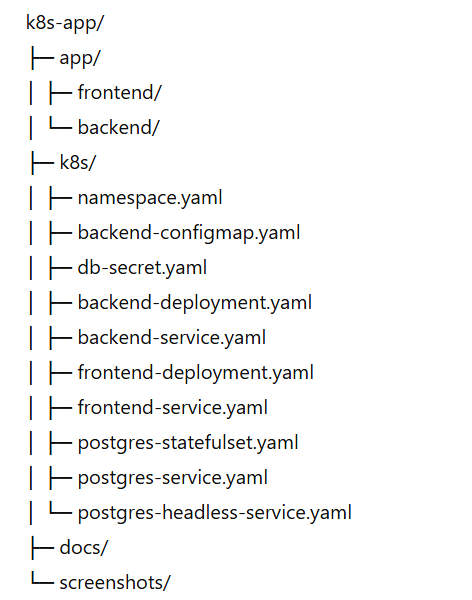
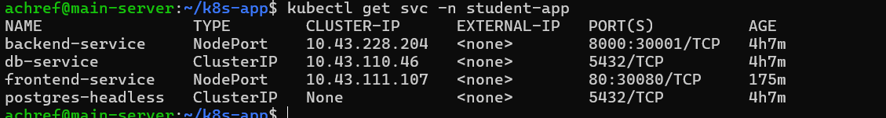
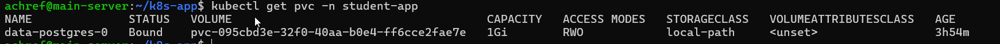
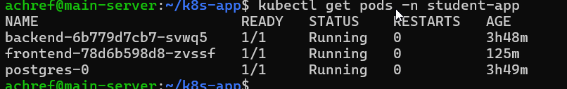
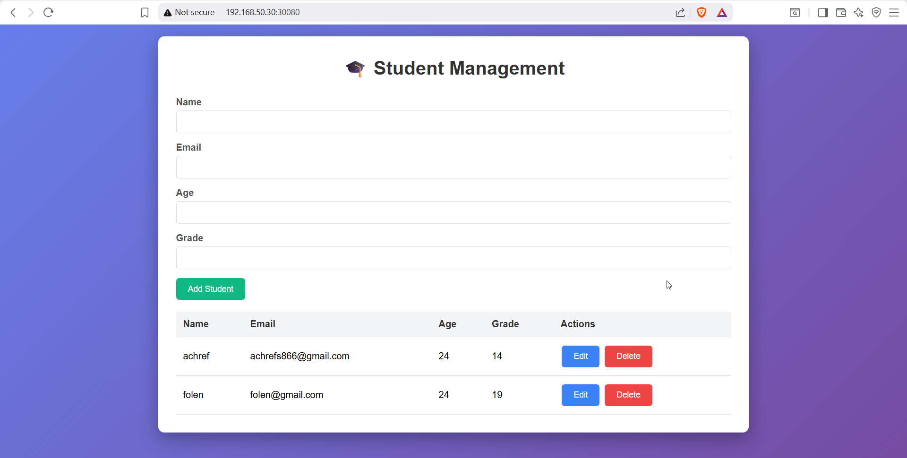
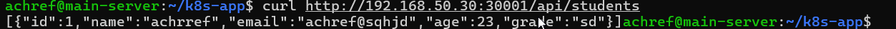
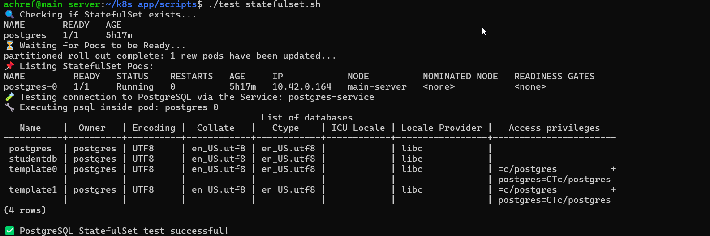

# Three-Tier K8s Application Deployment

This repository contains a **full three-tier application** deployment on Kubernetes using K3s. It includes a **frontend**, **backend**, and **PostgreSQL database**.  

All steps, commands, and screenshots are documented for clarity.

---

## 📁 Folder Structure

## 1️⃣ Build & Push Docker Images

Create Kubernetes Namespace

#Deploy Backend

kubectl apply -f k8s/backend-deployment.yaml

kubectl apply -f k8s/backend-service.yaml

kubectl apply -f k8s/backend-configmap.yaml

 
#Deploy frontend:

kubectl apply -f k8s/frontend-deployment.yaml

kubectl apply -f k8s/frontend-service.yaml

#Deploy PostgreSQL StatefulSet with PVC

kubectl apply -f k8s/db-secret.yaml

kubectl apply -f k8s/postgres-statefulset.yaml

kubectl apply -f k8s/postgres-service.yaml

kubectl apply -f k8s/postgres-headless-service.yaml

 Check service:
 

Check PVC:

Check pods:

Verify the Application

Frontend: http://192.168.50.30:30080

Backend: http://192.168.50.30:30001/api/students

Test API requests:

curl http://192.168.50.30:30001/api/students

Update Images

### Test

When code changes:

Rebuild and push Docker images:

./build_push.sh

Delete existing deployments:

kubectl delete deployment frontend -n student-app

kubectl delete deployment backend -n student-app
